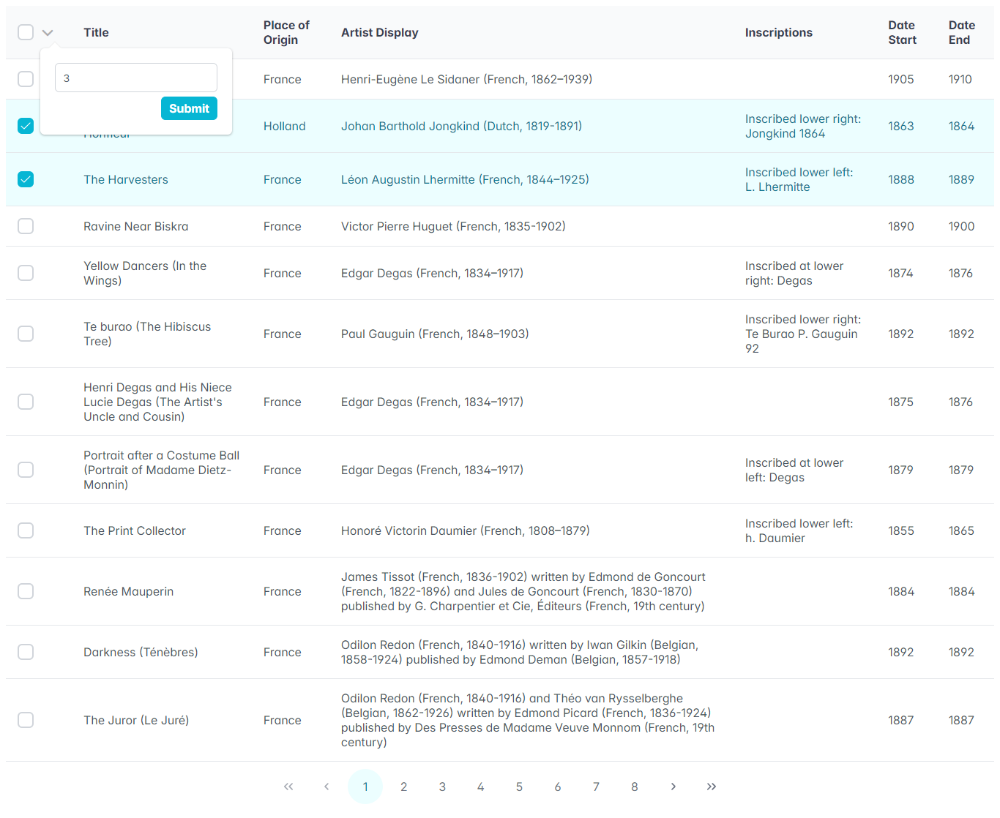

## [Deployed Link](https://gmo-assignment-by-charan.netlify.app)

## [Video Demo Link](https://www.youtube.com/watch?v=tSrVGOPK9ok)

## Description

- Used `Map<key:pageNo, value:firstNRowsNo>` to remember the selections which are not present in current page and yet to be selected when the specific page is visited (logging this for every page visit).

Ex: {2=>12, 3=>5, 6=>8} which means, first (12, 5, 8) rows are yet to be selected on (2, 3, 6) pages respectively.

